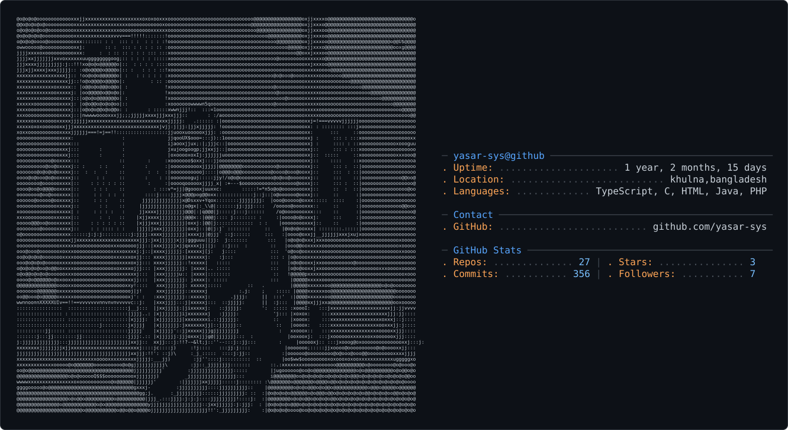

<div align="center">


<br/><br/>

<a href="mailto:saminyasarsunny@gmail.com"></a>
<a href="https://www.linkedin.com/in/samin-yasar-b2ba06239"></a>
<a href="https://wa.me/8801865239302"></a>

<br/><br/>


</div>

<br/>

## 🏷️ About Me

```yaml
whoami:
  name: "Samin Yasar Sunny"
  role: "🎓 CSE Student @ Mymensingh Engineering College (DU)"
  identity:
    - 🧠 Dreamer • Programmer
    - 🪖 ISSB Green Card Holder (Navy)
    - 🎯 DEO & Army SSC Aspirant
    - 🐍 Independent Developer — powered by Python, OpenAI & Vision
  currently_building: "My own J.A.R.V.I.S using Python + AI 💻"
```

<br/>

<div align="center">
  <picture>
    <source media="(prefers-color-scheme: dark)" srcset="dark_mode.svg" />
    <source media="(prefers-color-scheme: light)" srcset="light_mode.svg" />
    
  </picture>
</div>

<br/>

## 🧰 Languages & Tools

<div align="center">


-FF8C00?style=for-the-badge)

</div>

<br/>

## 🚀 My Projects

<div align="center">

| Project | Description |
|---|---|
| 🤖 **[Jarvis AI Assistant](https://github.com/yasar-sys/jarvis-ai)** | Python + AI powered personal voice assistant |
| 🎮 **[Snake Game — Modern UI](https://github.com/yasar-sys/snake-game)** | Classic snake game with a redesigned modern interface |
| 📘 **[C Programming (MEC Lab)](https://github.com/yasar-sys/cse1201-c-lab)** | Coursework & lab solutions for CSE1201 at MEC |
| 💬 **[WhatsApp Voice Bot](https://github.com/yasar-sys/whatsapp-bot)** | Voice-driven WhatsApp automation bot |

</div>

> 💡 Click a project name to jump straight to the repo.

<br/>

## 📊 GitHub Stats

<div align="center">


</div>

<br/>

<div align="center">

### 🏆 GitHub Trophies


</div>

<br/>

<div align="center">

### 🔥 GitHub Streak


</div>

<br/>

<div align="center">

### 📍 Contribution Heatmap


</div>

<br/>

<details>
<summary><b>🐍 Contribution Snake</b> (auto-generated via GitHub Actions — click to expand)</summary>
<br/>

Add this at `.github/workflows/snake.yml` to get an animated snake eating your contribution graph:

```yaml
name: Generate Snake
on:
  schedule:
    - cron: "0 0 * * *"
  workflow_dispatch:
  push:
    branches: [main]

permissions:
  contents: write

jobs:
  generate:
    runs-on: ubuntu-latest
    steps:
      - uses: Platane/snk@v3
        with:
          github_user_name: ${{ github.repository_owner }}
          outputs: dist/github-contribution-grid-snake.svg?palette=github-dark
      - uses: crazy-max/ghaction-github-pages@v4
        with:
          target_branch: output
          build_dir: dist
        env:
          GITHUB_TOKEN: ${{ secrets.GITHUB_TOKEN }}
```

Then embed it:

```md

```

</details>

<br/>

<div align="center">

### 📱 Now Playing on Spotify


> 🎵 Keep Spotify open with "Recently Played" enabled for this to stay live.

</div>

<br/>

<div align="center">

### 💡 Daily Quote


</div>

<br/>

<div align="center">


</div>

<br/>

## 🌐 Let's Connect

<div align="center">

<a href="https://www.facebook.com/share/16eh8m5UWJ/"></a>
<a href="https://www.instagram.com/yasar_2.00?igsh=MXZiYnE0N2pzZzZjOA=="></a>
<a href="https://www.linkedin.com/in/samin-yasar-b2ba06239"></a>
<a href="mailto:saminyasarsunny@gmail.com"></a>
<a href="https://youtube.com/@yourchannel"></a>
<a href="https://wa.me/8801865239302"></a>

</div>

<br/>

<div align="center">


</div>
